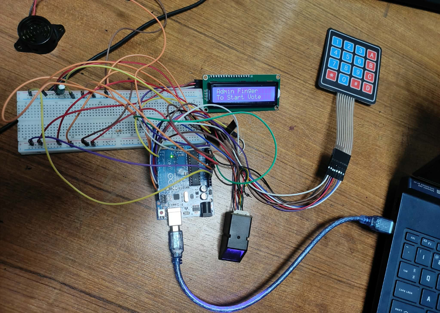
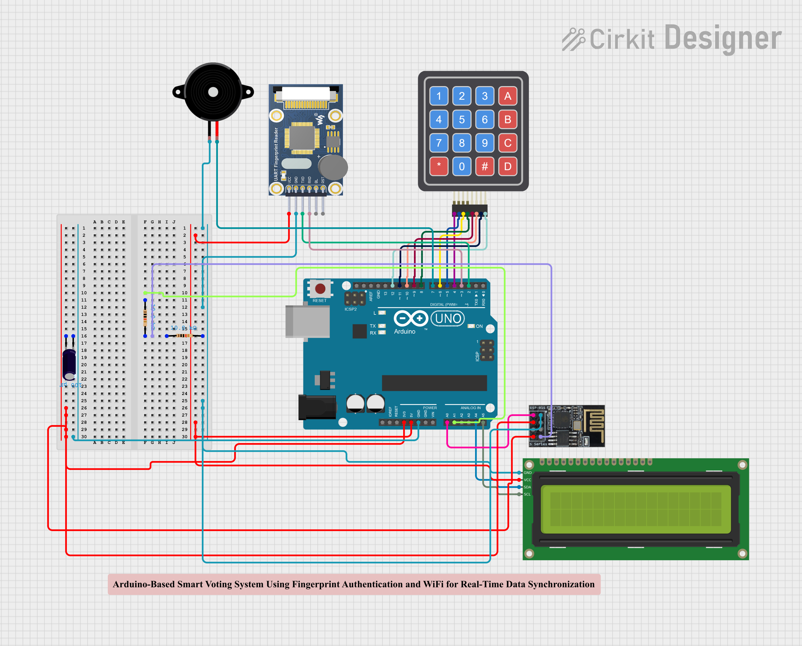

# Arduino-Based Smart Electronic Voting Machine with Real-Time Result Monitoring

## Project Report
[Click here to read the full Project Report (PDF)]([Conference-template-A4.pdf](Project_Report.pdf))

### Physical Prototype
 
### Project Circuit Diagram

## Overview
The primary aim of this project is to build an electronic voting system that is secure and affordable, making it ideal for small-scale elections like university clubs or local community groups. Instead of traditional voting methods, we use fingerprint recognition to verify voters. 

We also integrated an ESP8266 (ESP-01) WiFi module so the system can send voting results in real time to ThingSpeak. This allows anyone to monitor the election live through a web dashboard.

## Key Features
* **Fingerprint Authentication:** We use a biometric sensor to check who is voting. This stops people from voting more than once and prevents identity fraud.
* **Live Result Monitoring:** The system connects to WiFi and sends the vote counts straight to a ThingSpeak dashboard as they happen.
* **Admin Controls:** There is a dedicated admin fingerprint required to officially start and stop the voting session.
* **Audio and Visual Feedback:** We included an LCD screen and a buzzer so the voter gets clear feedback on what is happening, such as whether a scan passed or failed.

## Hardware Requirements
For this build, we used the following components:
* Arduino Uno R3
* UART Fingerprint Reader
* ESP8266 (ESP-01) WiFi Module
* 4x4 Matrix Keypad
* 16x2 LCD Display with I2C Module
* Active Buzzer
* Basic prototyping gear including a breadboard, jumper wires, and resistors for the ESP8266 voltage divider

## Circuit & Wiring
Here is how the main components connect to the Arduino:

| Component | Arduino Pin | Notes |
| :--- | :--- | :--- |
| **Fingerprint Sensor** | D2 (TX), D3 (RX) | Uses SoftwareSerial |
| **ESP8266 (ESP-01)** | A0 (TX), A1 (RX) | Uses SoftwareSerial and a voltage divider for the RX pin |
| **Buzzer** | D7 | |
| **Keypad (Rows)** | D4, D5, D6, D8 | |
| **Keypad (Cols)** | D9, D10, D11, D12 | |
| **LCD (I2C)** | SDA, SCL | Standard I2C address is usually 0x27 |

## Software & Libraries
We wrote the code using the Arduino IDE. You will need to install the following libraries to get it running:
* Adafruit_Fingerprint
* LiquidCrystal_I2C
* Keypad
* SoftwareSerial

## Setup & Usage

**1. ThingSpeak Setup**
* Create a free account on ThingSpeak.
* Create a new channel with 6 fields: Party A Count, Party B Count, Party C Count, Last Voted Party, Voter ID, and System Status.
* Keep your Write API Key handy.

**2. Code Configuration**
* Open the `IoT_EVM_Node.ino` file.
* Update the code with your WiFi SSID and password.
* Paste your ThingSpeak Write API Key into the designated variable.
* Set your Admin Fingerprint ID, which is set to ID 3 by default in the code.

**3. Running the System**
* **Registering Fingers:** Before running the main code, save the admin's fingerprint and the voters' fingerprints to the sensor.
* **Booting Up:** Upload the main voting code and power on the system. It will initialize the sensor, connect to WiFi, and wait.
* **Starting the Vote:** The admin scans their finger to open the polls.
* **Voting:** A voter scans their finger. If recognized, the LCD asks them to use the keypad to pick a candidate, pressing 1 for A, 2 for B, or 3 for C. The system records the vote, beeps, and uploads the data to ThingSpeak.
* **Stopping the Vote:** The admin scans their finger again to close the polls. The system uploads the final status and displays the winner locally on the LCD.

**Institution:** American International University-Bangladesh (AIUB)
**Department:** Dept. of Computer Science and Engineering

## License
This project is licensed under the MIT License - see the [LICENSE](LICENSE) file for details.
